# Proyecto RA5
# Proyecto Calculadora con Jenkins

## Punto 1 – Instalación de Jenkins

Para la instalación del servidor Jenkins se siguió el procedimiento detallado en el siguiente tutorial:

> [Cómo instalar Jenkins en Ubuntu 21.04 - Solvetic](https://www.solvetic.com/tutoriales/article/10130-como-instalar-jenkins-en-ubuntu-21-04/)

Tras la instalación, se accedió a la interfaz web para completar la configuración inicial de plugins y administración del sistema.  
**Figura 1 –** Configuración inicial de Jenkins con selección de plugins.  
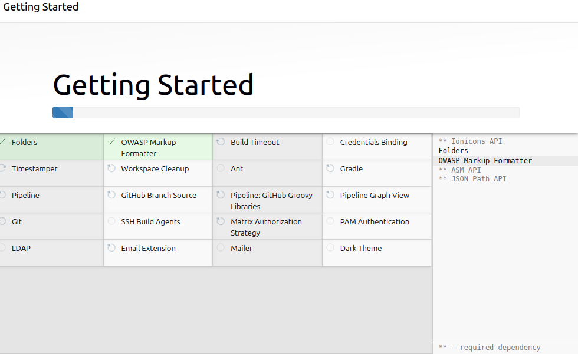

---

## Tarea 1 – Script de Calculadora y Pruebas Unitarias

Se desarrolló un programa en Python que permite multiplicar dos números pasados como argumentos por línea de comandos. Además, se implementaron pruebas unitarias utilizando la biblioteca estándar `unittest`.

### Archivos creados

- `calculadora.py`: contiene la clase `Calculadora` con el método `multiplicar`.
- `test_calculator.py`: contiene las pruebas unitarias que verifican el funcionamiento del método.

**Figura 2 –** Código de `calculadora.py` implementado.  
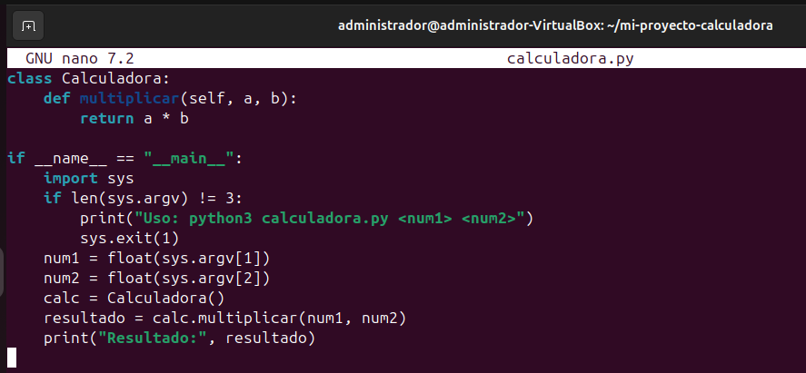

**Figura 3 –** Código de `test_calculator.py` con pruebas unitarias.  
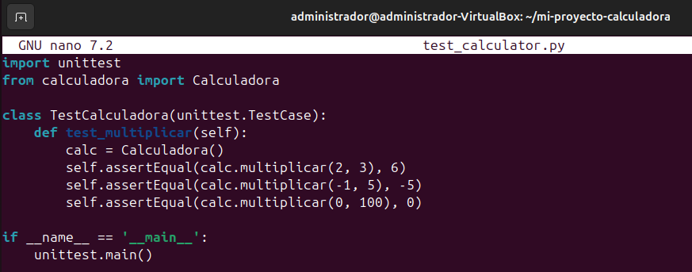

---


## Tarea 2 – Integración Continua con Jenkins

Para esta tarea se configuró una canalización de integración continua (CI) para automatizar la ejecución de pruebas en cada cambio del repositorio.

### Jenkinsfile

Se utilizó un `Jenkinsfile` como base de la canalización. Este archivo define las etapas necesarias para clonar el código desde GitHub y ejecutar las pruebas unitarias mediante `unittest`.


pipeline {
    agent any

    stages {
        stage('Clonar código') {
            steps {
                git branch: 'main', url: 'https://github.com/pps10711239/mi-proyecto-calculadora.git'
            }
        }

        stage('Ejecutar test') {
            steps {
                sh 'python3 -m unittest test_calculator.py'
            }
        }
    }
}

**Figura 5 –** Interfaz de Jenkins configurando el `Jenkinsfile`.
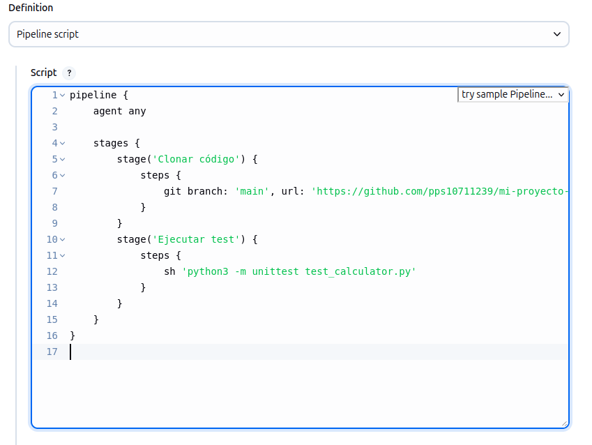

---

### Configuración del proyecto en Jenkins

Se configuró el proyecto para que la canalización leyera el `Jenkinsfile` directamente desde el repositorio mediante el modo "Pipeline script from SCM".

**Figura 6 –** Configuración del proyecto en Jenkins con Git como fuente de SCM.
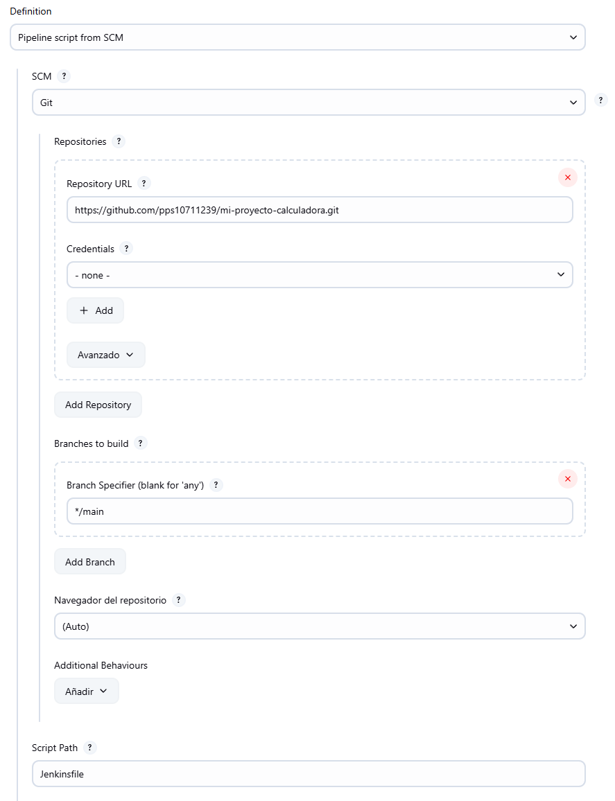

Se especificó el branch `main` y la ruta del archivo `Jenkinsfile`.

---

### Activación del trigger automático por push

Para que la canalización se ejecutara automáticamente ante cualquier nuevo commit, se activó la opción `GitHub hook trigger for GITScm polling` en los ajustes del proyecto de Jenkins.

**Figura 7 –** Configuración del trigger automático.
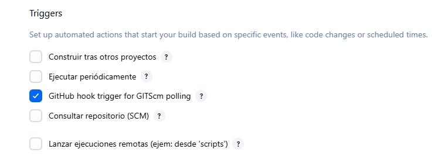

---

### Exposición de Jenkins con ngrok

Debido a que Jenkins se ejecuta localmente, se utilizó **ngrok** para exponerlo a Internet, permitiendo así que GitHub pueda enviar peticiones webhook al servidor.

**Figura 8 –** Sesión activa de ngrok con URL pública.
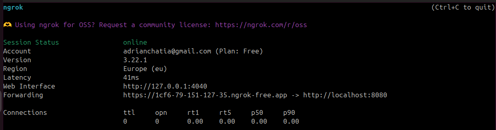

---

### Configuración del webhook en GitHub

Se configuró un webhook en el repositorio de GitHub que apunta a la URL pública proporcionada por ngrok. Esto permite que GitHub notifique a Jenkins cuando hay nuevos cambios.

**Figura 9 –** Configuración del webhook en GitHub.
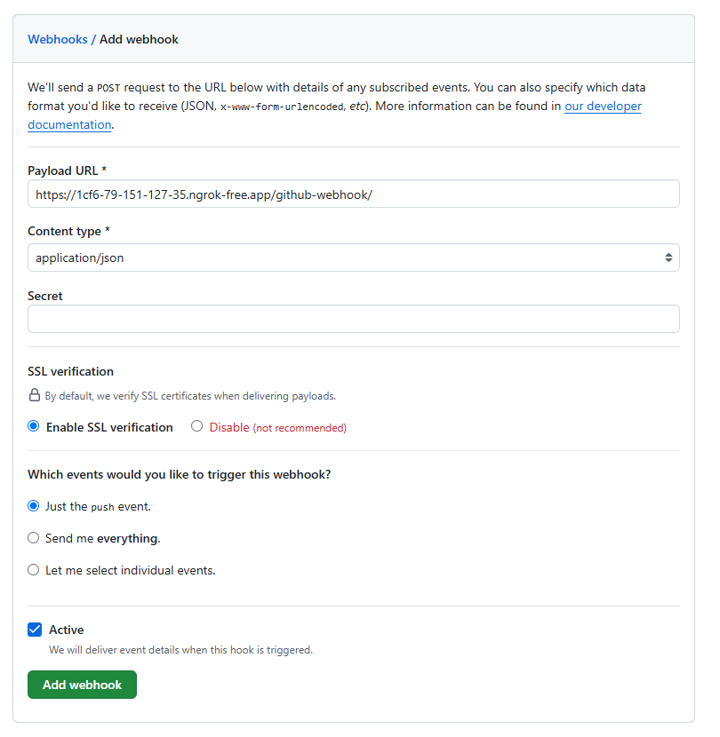

---

### Evidencia de ejecución automática

Al realizar un nuevo commit y hacer push (`git push`), la canalización se ejecutó automáticamente.

**Figura 10 –** Confirmación y envío de cambios desde terminal.
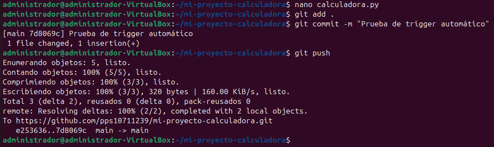

**Figura 11 –** Resultado exitoso de la ejecución #2 en Jenkins, iniciada por GitHub.
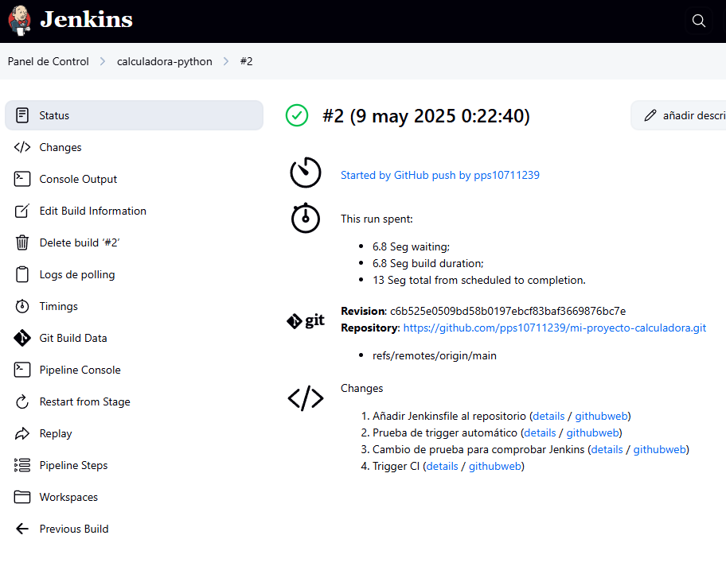

Además, se puede consultar el log completo del pipeline en:
📄 [`assets/2.txt`](assets/2.txt)

---

# Punto 3.2 – Pipeline con Docker en Jenkins

## Configuración del proyecto Docker en Jenkins

Se creó un nuevo proyecto Jenkins específico para la pipeline Docker con las siguientes configuraciones clave:

**Figura 12 –** Configuración del proyecto con trigger GitHub  
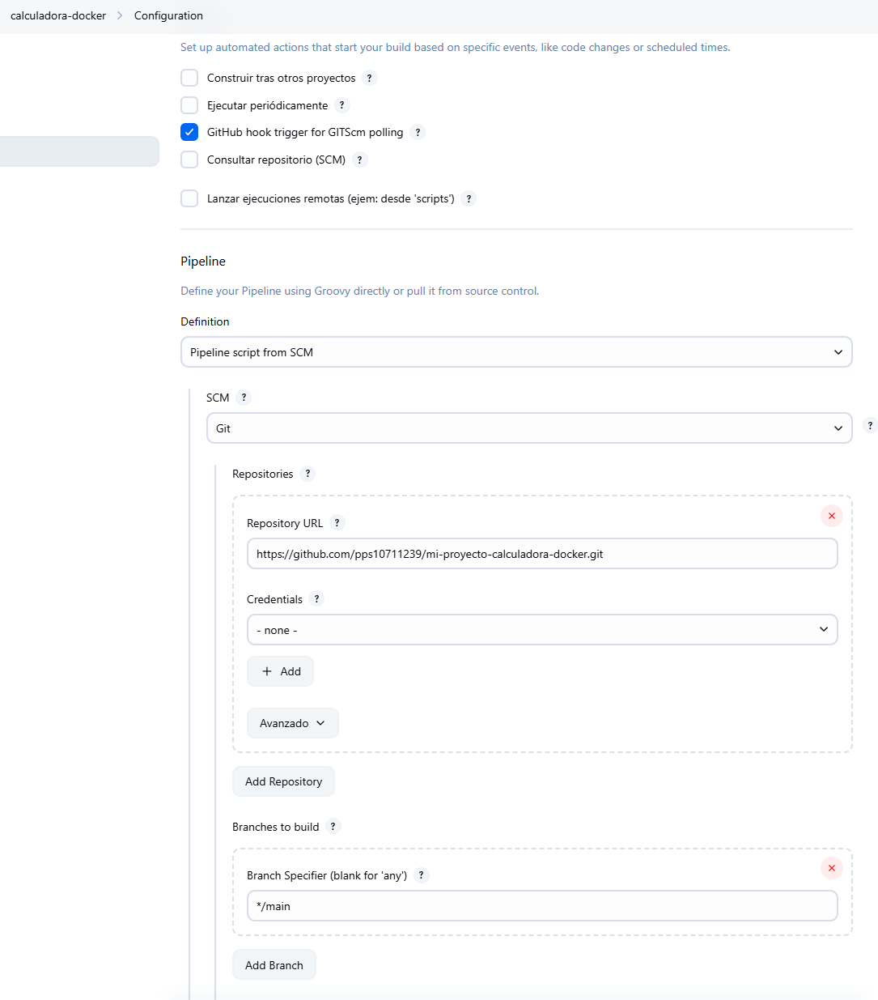

- Activado **GitHub hook trigger for GITScm polling** para ejecuciones automáticas
- Definición de pipeline desde SCM (Git)
- URL del repositorio: `https://github.com/pps10711239/mi-proyecto-calculadora-docker.git`
- Branch: `main`
- Ruta del Jenkinsfile: `jenkinsfile.docker`

**Figura 13 –** Especificación del Jenkinsfile.docker  
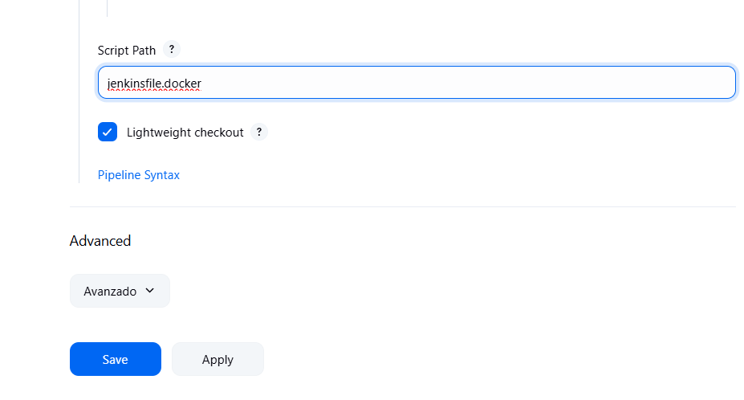

---

## Ejecución de la pipeline Docker

La pipeline se ejecutó automáticamente tras un push al repositorio, completando todas las etapas definidas:

**Figura 14 –** Vista general de ejecuciones  
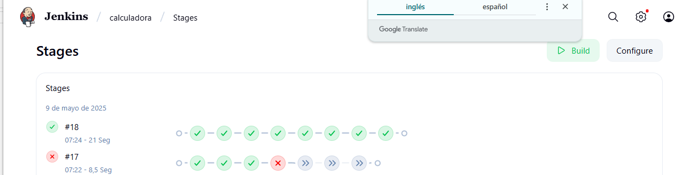

- **Build #18**: Ejecutada el 9 de mayo de 2025
- **Duración**: 21 segundos
- **Estado**: Éxito completo

---

### Detalles de la ejecución

**Figura 15 –** Gráfico de tiempos por etapa  


| Etapa | Duración |
|-------|----------|
| Checkout SCM | 0.97 seg |
| Clonar código | 0.54 seg |
| Construir imagen Docker | 5 seg |
| Eliminar contenedor anterior | - |
| Ejecutar contenedor | 0.53 seg |
| Ejecutar tests | 0.56 seg |
| Parar y limpiar contenedor | 10 seg |
| Ejecutar docker-compose | 1 seg |

---

## Resultados clave por etapa

1. **Construcción de imagen Docker**:
   ```bash
   docker build -t calc-image .
   
   - Descargada imagen base `python:3.9-slim`
   - Instaladas dependencias (pytest) correctamente
   - Imagen creada con ID: `4c2ae7e546ab`

2. **Ejecución de contenedor**:
   ```bash
   docker run --name calc-container -d calc-image
   ```
   - Contenedor iniciado con ID: `327b3c1942b7`

3. **Pruebas unitarias**:
   ```bash
   docker exec calc-container pytest test_calculator.py
   ```
   - **5 tests ejecutados** con éxito (100% passed)
   - Tiempo de pruebas: 0.03 segundos

4. **Despliegue con docker-compose**:
   ```bash
   docker compose up --build -d
   ```
   - Advertencia sobre atributo `version` obsoleto (se mantiene por compatibilidad)
   - Red y contenedor creados correctamente

---

## Validación final

El log completo de la ejecución (#18) está disponible en:  
📄 [`assets/18.txt`](assets/18.txt)

**Resultado final**:  
✅ Pipeline completada con estado **SUCCESS**  
🛠️ Imagen Docker y contenedores desplegados correctamente  
✔️ Todas las pruebas unitarias aprobadas  
⚡ Tiempo total de ejecución: 21 segundos

