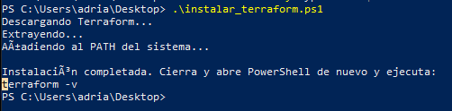
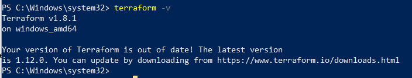
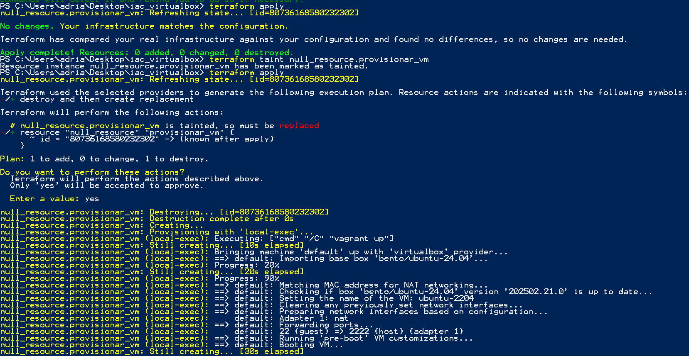
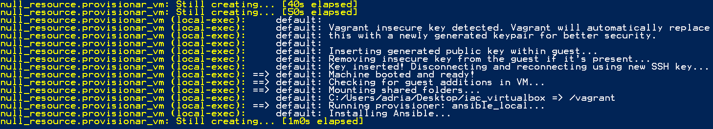
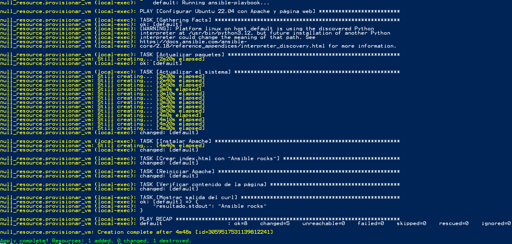
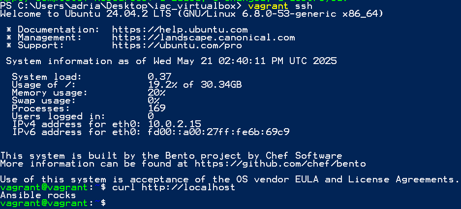

# RA5.2 – IaC: Infrastructure as Code 🛠️🚀

## Índice

1. [Instalación de Terraform](#instalación-de-terraform)
2. [Archivos del proyecto](#archivos-del-proyecto)
3. [Cómo se ejecuta todo esto](#cómo-se-ejecuta-todo-esto)
4. [Pruebas de que funciona](#pruebas-de-que-funciona)

---

## Instalación de Terraform

Para no estar descargando y configurando Terraform a mano, se creó un script en PowerShell: [`instalar_terraform.ps1`](assets/instalar_terraform.ps1).
Este script hace todo automáticamente:

* Crea una carpeta `C:\Terraform`.
* Descarga Terraform desde la web oficial.
* Lo descomprime.
* Y lo mete en el PATH del sistema para que se pueda usar desde cualquier terminal.

Así de cómodo 😎

### Aquí se ve la instalación en marcha:


**Figura 1. Instalación de Terraform en Windows**

---

## Comprobación

Después de cerrar y volver a abrir PowerShell, ejecuté:

```bash
terraform -v
```

Y aquí se ve que está todo OK con la versión 1.8.1 instalada:


**Figura 2. Terraform correctamente instalado**

---

## Archivos del proyecto

### [`main.tf`](assets/main.tf)

Archivo de Terraform que ejecuta un simple `vagrant up`. Con eso arranca la VM y el resto lo hace Vagrant + Ansible.

```hcl
resource "null_resource" "provisionar_vm" {
  provisioner "local-exec" {
    command = "vagrant up"
  }
}
```

---

###  [`Vagrantfile`](assets/Vagrantfile)

Aquí se define la VM con Ubuntu 22.04, 2 CPUs, 2 GB de RAM y se le pasa el playbook de Ansible para que se configure sola.

También se monta la carpeta del proyecto como `/vagrant` en la VM, para que Ansible pueda leer el archivo `servidor.yml`.

```ruby
ansible.playbook = "/vagrant/servidor.yml"
```

---

### [`servidor.yml`](assets/servidor.yml)

Este es el playbook que se ejecuta dentro de la VM. Hace lo siguiente:

* Actualiza los paquetes.
* Instala Apache.
* Crea un `index.html` con el texto obligatorio `Ansible rocks`.
* Reinicia Apache.
* Y hace un `curl` para comprobar que todo está OK.

Bien automatizado y sin tocar nada a mano 💪

---

## Cómo se ejecuta todo esto

Primero inicié Terraform:

```bash
terraform init
```

Y salió todo bien:


**Figura 3. Terraform init**

---

Luego ejecuté:

```bash
terraform apply
```

La primera vez no hacía nada porque ya había ejecutado antes, así que forzamos la ejecución con:

```bash
terraform taint null_resource.provisionar_vm
terraform apply
```

Y así sí que levantó la máquina y empezó todo el proceso:


**Figura 4. terraform apply con taint**

---

## Pruebas de que funciona

### 🛠️ El despliegue completo

Aquí se ve cómo Ansible se encargó de todo: actualizaciones, Apache, HTML y comprobaciones. Todo sin fallos.


**Figura 5. Proceso de provisión con Ansible**

---

### ✅ Validación desde dentro de la VM

Me conecté con `vagrant ssh` y ejecuté un `curl` para asegurarme que Apache devolvía lo que tenía que devolver:

```bash
curl http://localhost
```

Resultado:

```bash
Ansible rocks
```

📅 Misión cumplida.


**Figura 6. curl dentro de la VM**

---

### 🧐 Verificación desde el playbook

El playbook también hace un `curl` automático y muestra el resultado en pantalla:

```yaml
- name: Mostrar salida del curl
  debug:
    var: resultado.stdout
```

Aquí se ve cómo lo saca al final:


**Figura 7. Resultado mostrado por Ansible**

---

## 🎉 Conclusión

Este proyecto junta Terraform, Vagrant y Ansible para levantar y configurar una máquina desde cero.
Todo automático, todo limpio y todo funcionando.

Infraestructura como código, pero bien hecha 😎

---
