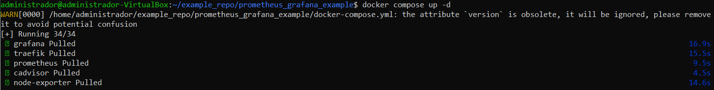
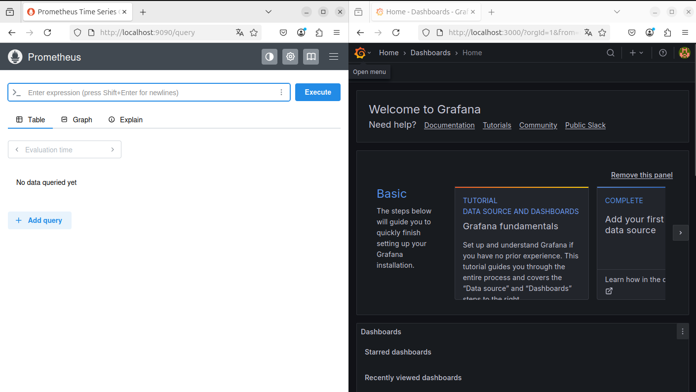
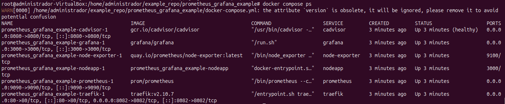
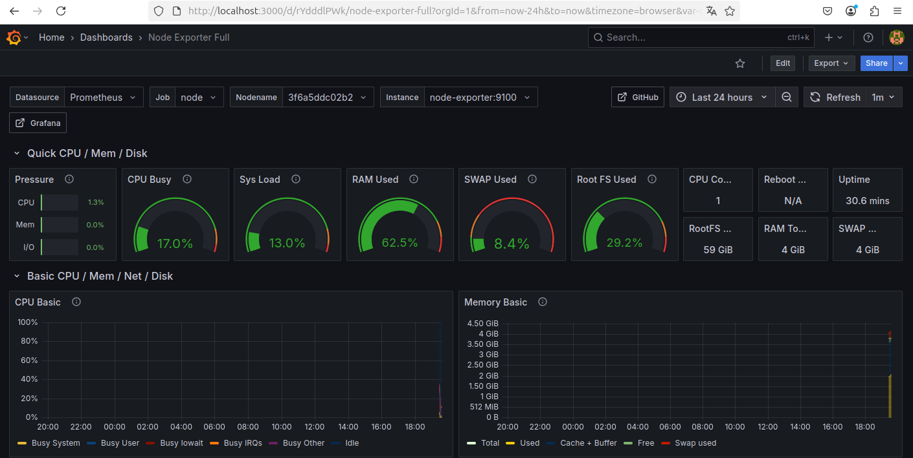
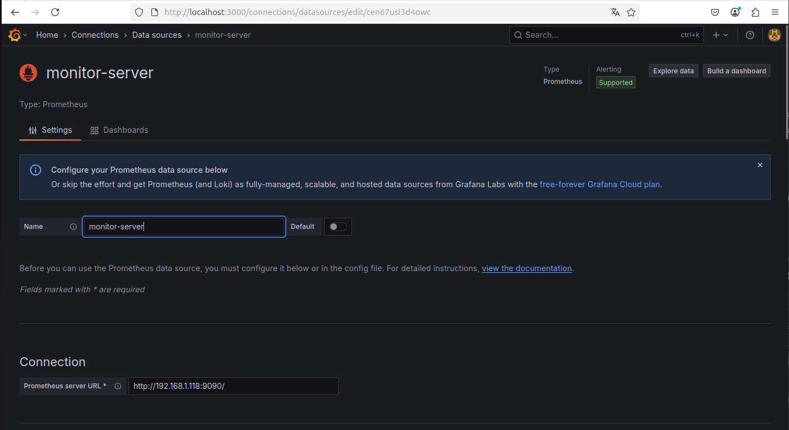
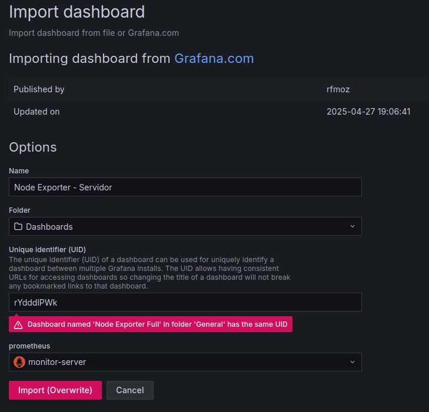
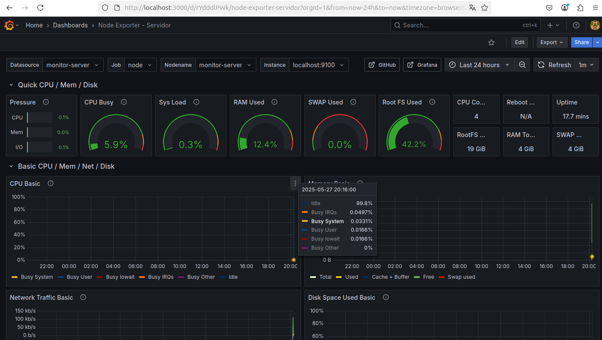

**Índice**

1. Introducción
2. Ejercicio 3.1: Monitorización con Prometheus y Grafana (Stack Completo)
3. Ejercicio 3.2: Monitorización Remota de un Servidor Ubuntu desde Cliente Ubuntu

---

### 1. Introducción

A lo largo de esta práctica se ha llevado a cabo la configuración y despliegue de un entorno de monitorización utilizando Prometheus, Grafana, Node Exporter, cAdvisor y Traefik. Este entorno permite recopilar, almacenar y visualizar métricas de sistemas y aplicaciones. Se ha trabajado tanto en un stack completo desplegado localmente como en una configuración distribuida con monitorización remota.

---

### 2. Ejercicio 3.1: Monitorización con Prometheus y Grafana (Stack Completo)

En este apartado se ha creado y configurado un stack completo compuesto por los siguientes servicios: Prometheus, Grafana, Traefik, Node Exporter, cAdvisor y una aplicación NodeJS. Todos ellos se han desplegado en un entorno Docker Compose.

Primero, se desplegó el stack con el comando correspondiente y se comprobó que todos los contenedores estaban en ejecución:

Como se muestra en la siguiente figura:

*Figura 1. Imagen del estado de los contenedores desplegados.*

Posteriormente, se accedió al panel de Prometheus y Grafana, verificando que los servicios estaban accesibles a través de los puertos configurados:

*Figura 2. Imagen del acceso a Prometheus y Grafana.*

Se importó el dashboard de Node Exporter para visualizar métricas detalladas del sistema:

*Figura 3. Imagen del dashboard Node Exporter mostrando métricas.*

---

### 3. Ejercicio 3.2: Monitorización Remota de un Servidor Ubuntu desde Cliente Ubuntu

En este apartado se configuró una infraestructura distribuida en la que un servidor Ubuntu expone métricas mediante Prometheus y Node Exporter, mientras que un cliente Ubuntu monitoriza el servidor a través de Grafana.

Primero, se configuró Prometheus en el servidor Ubuntu y se comprobó su funcionamiento accediendo a la interfaz web:

*Figura 4. Imagen del acceso a Prometheus del servidor.*

Luego, en el cliente Ubuntu se accedió a Grafana y se añadió Prometheus como origen de datos, apuntando a la IP del servidor para recopilar métricas remotas:

*Figura 5. Imagen de la configuración del origen de datos Prometheus en Grafana.*

Finalmente, se importó y visualizó el dashboard Node Exporter en Grafana del cliente, mostrando métricas detalladas del servidor remoto:

*Figura 6. Imagen del dashboard Node Exporter con métricas del servidor remoto.*

Con esta configuración, se completó la monitorización remota y se demostró la recopilación y visualización de métricas del servidor desde el cliente.

---

*Figura 7. Imagen final del entorno completo de monitorización.*
