# RA5.4 K3’s & K9’s

## Índice

1. Introducción
2. Despliegue K3s Single-Node y Nginx
3. Despliegue K3s HA y Nginx
4. Despliegue docker-compose en K3s y validación con K9s

## Introducción

En los últimos años, la evolución del desarrollo de software y la creciente complejidad de las aplicaciones modernas han impulsado la necesidad de herramientas potentes y flexibles para la gestión de infraestructura. En este contexto, Kubernetes se ha consolidado como uno de los pilares fundamentales de la computación en la nube, la orquestación de contenedores y el DevOps.
K3s y K9s, como herramientas complementarias, aportan facilidad de uso, escalabilidad y capacidad de gestión a Kubernetes, incluso en entornos con recursos limitados. Este trabajo explorará sus características, arquitecturas y el despliegue de aplicaciones como nginx en estas plataformas.

## 2. Despliegue K3s Single-Node y Nginx

En este apartado se describe el proceso completo para realizar la instalación, configuración y validación de K3s en modo single-node, junto con el despliegue de un servicio nginx con dos réplicas, utilizando K9s para monitorizar el estado de los recursos.

### Instalación y configuración de K3s

1. Se instala K3s en un nodo único con los comandos necesarios para configurar los permisos, la conexión y la validación de los nodos. Se emplea el siguiente comando para comprobar los nodos disponibles:

```bash
sudo kubectl get nodes
```

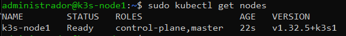

### Despliegue del servicio nginx

2. Se crea y aplica un archivo YAML con la definición del deployment de nginx con dos réplicas. A continuación, se ejecutan los siguientes comandos:

```bash
kubectl apply -f nginx-deploy.yaml
kubectl get pods
kubectl get svc
```

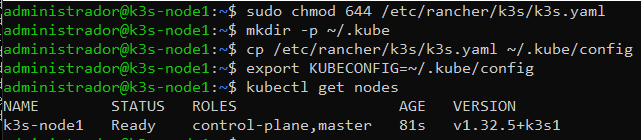

3. Verificamos que los pods están en estado "Running" y que el servicio nginx está accesible a través del puerto asignado.

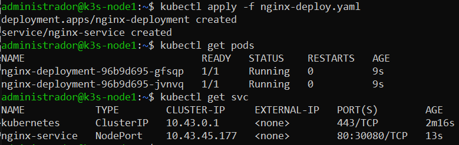

### Validación con K9s

4. Utilizando la herramienta K9s, accedemos al clúster y navegamos por los pods y servicios desplegados. Aquí podemos ver información sobre el estado de los pods, el uso de recursos y la IP asignada.

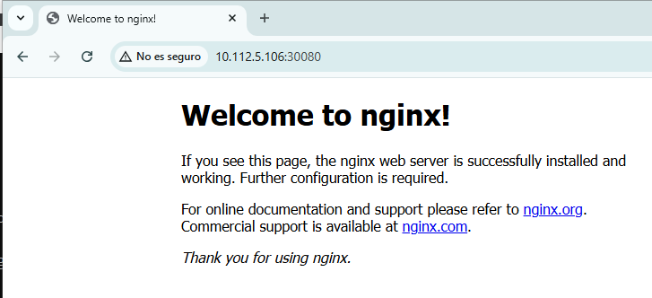
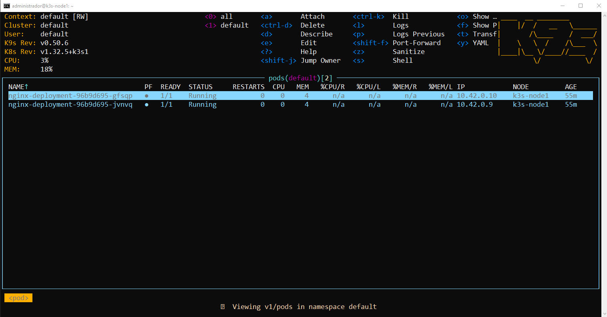

### Prueba de acceso a nginx

5. Finalmente, se verifica el acceso al servicio nginx desde un navegador, usando la IP y el puerto expuestos por el servicio.


Con estos pasos, se ha completado la instalación de K3s en modo single-node, el despliegue de nginx con dos réplicas y la validación mediante K9s y acceso web.

## 3. Despliegue K3s HA y Nginx

En este apartado se describe el proceso para la instalación, configuración y validación de un clúster K3s en modo alta disponibilidad (HA) y el despliegue de un servicio nginx con dos réplicas, utilizando K9s para monitorizar el estado del clúster y los recursos.

### Instalación y configuración de K3s en modo HA

1. Se instalan múltiples nodos master que conforman el plano de control del clúster K3s en modo HA. Durante el proceso, se configuran los tokens de autenticación, se establece la comunicación entre los nodos y se despliega el plano de control. Los comandos utilizados permiten unir los nodos al clúster y verificar su estado:

```bash
sudo kubectl get nodes
```

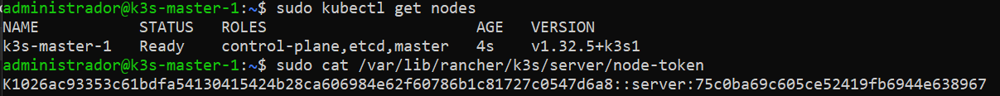

### Configuración y unión de nodos

2. Los nodos adicionales se añaden al clúster utilizando el token generado en el nodo inicial y el comando de instalación correspondiente. La correcta unión de los nodos se comprueba mediante:

```bash
sudo kubectl get nodes
```

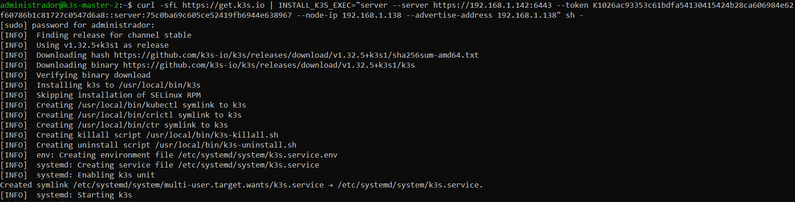
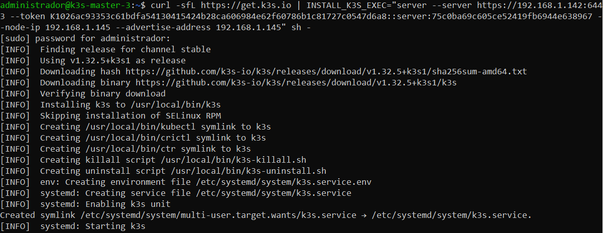

### Despliegue del servicio nginx en modo HA

3. Se aplica el deployment de nginx y se comprueba que los pods estén en estado "Running" y distribuidos entre los nodos master del clúster. Los comandos utilizados son:

```bash
kubectl apply -f nginx-deploy.yaml
kubectl get pods
```

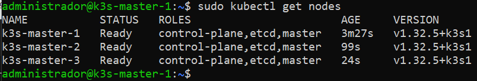
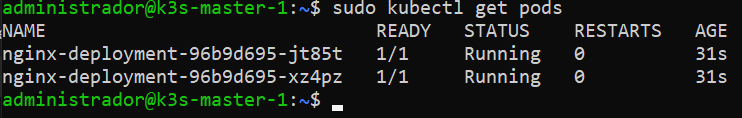

### Validación con K9s

4. Con la herramienta K9s se realiza el monitoreo del clúster, validando el estado de los pods, los recursos y las IPs de los nodos.

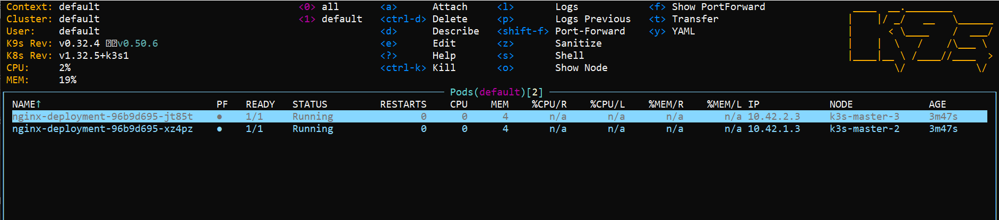

Con estos pasos se completa el despliegue del clúster K3s en modo HA, con el servicio nginx en funcionamiento y monitorizado a través de K9s.

